# Observability

This repository now includes a baseline observability stack for production debugging and alerting:

- Sentry for frontend and backend error tracking
- New Relic for optional backend APM
- Prometheus for metrics scraping
- Grafana for dashboards
- Loki + Promtail for centralized log aggregation
- Blackbox Exporter for external uptime probes and WebSocket handshake validation
- Alertmanager for alert routing

## Blackbox uptime probes
Prometheus scrapes the Blackbox Exporter to validate externally visible availability across the main public surfaces.
The current deployment probes:

- `http://frontend:80/` — frontend application root
- `http://backend:3001/readiness` — backend deep readiness check
- `http://backend:3001/health` — backend process liveness
- `http://backend:3001/` — backend public API root
- `http://backend:3001/api-docs` — backend API documentation page
- `http://backend:3001/` via WebSocket handshake using `Upgrade: websocket`

The blackbox configuration is stored in `deployment/observability/blackbox/blackbox.yml`, and Prometheus scrape jobs are defined in `deployment/observability/prometheus/prometheus.yml`.

## Backend

Backend observability is enabled with environment variables in [backend/.env.example](C:\Users\HP\Documents\students\drips\stellar-portfolio-rebalancer\backend.env.example).

- `SENTRY_ENABLED=true` and `SENTRY_DSN=...` send unhandled backend exceptions to Sentry.
- `SENTRY_ENVIRONMENT` should match the deployed tier, and `SENTRY_RELEASE` should be the full git SHA of the backend build.
- `NEW_RELIC_ENABLED=true` and `NEW_RELIC_LICENSE_KEY=...` enable backend APM.
- `METRICS_ENABLED=true` exposes Prometheus metrics at `GET /metrics`.

The deploy workflow resolves those values automatically before the Docker build starts. It writes:

- `SENTRY_RELEASE`
- `SENTRY_ENVIRONMENT`
- `LOG_DEPLOYMENT_ENV`

The values are sourced from the current git SHA and the target environment so backend logs, metrics, and Sentry events all point at the same deployment.

The backend publishes:

- request count and latency metrics
- in-flight request gauge
- readiness status gauge
- BullMQ queue depth metrics
- structured JSON logs for Loki ingestion

## Frontend

Frontend Sentry is configured at build time through Vite env vars in [frontend/.env.example](C:\Users\HP\Documents\students\drips\stellar-portfolio-rebalancer\frontend.env.example).

- `VITE_SENTRY_ENABLED=true`
- `VITE_SENTRY_DSN=...`
- `VITE_SENTRY_ENVIRONMENT` should match the deployed tier.
- `VITE_SENTRY_RELEASE` should be the full git SHA of the frontend build.

An application error boundary captures render failures and reports them to Sentry.


## Running The Stack

For the easiest and most robust setup, you can boot the local observability stack with a single command that validates prerequisites (Docker, daemon running, port conflicts), builds and runs the stack in the background, waits/polls all service health endpoints, and runs the health smoke tests:

```bash
npm run observability:up
```

Alternatively, you can execute the bootstrap script directly:

```bash
./scripts/bootstrap-observability.sh
```

Other helper commands:

- **Check service status:** `npm run observability:status`
- **Tear down the stack and clean data volumes:** `npm run observability:down`
- **Tear down without cleaning volumes:** `docker compose -f deployment/docker-compose.yml --profile monitoring down`

If you prefer to run the stack manually in the foreground:

```bash
docker compose -f deployment/docker-compose.yml --profile observability up --build
```

Main endpoints:

- App: `http://localhost:3000`
- Backend: `http://localhost:3001`
- Prometheus: `http://localhost:9090`
- Alertmanager: `http://localhost:9093`
- Grafana: `http://localhost:3003`
- Loki: `http://localhost:3100`

## Dashboards And Alerts

Grafana provisions:

- a Prometheus datasource
- a Loki datasource
- the `Portfolio Observability Overview` dashboard
- the `Queue Operations & Worker Lag` dashboard (for operational queue monitoring)

Prometheus alerts are preconfigured for:

- backend metrics endpoint down
- backend readiness failures
- frontend uptime failures
- elevated backend 5xx rate
- failed rebalance queue jobs
- stale Reflector price rows observed in the last 15 minutes
- excessive fallback price usage over the last hour

When one of those alerts fires, cross-check the matching Sentry release and environment tags before debugging the stack. That narrows the search to the exact build that produced the failure.

The backend exports dedicated price-quality metrics:

- `stellar_portfolio_price_feed_resolutions_total`
- `stellar_portfolio_reflector_stale_prices_total`
- `stellar_portfolio_reflector_fallback_usage_total`

Alertmanager ships alerts to `http://host.docker.internal:5001/alerts` by default. Replace that receiver with your Slack, PagerDuty, Opsgenie, or webhook destination before production rollout.

### Queue Operations Dashboard

The **Queue Operations & Worker Lag** dashboard (`queue-operations`) provides real-time visibility into background job processing health. It is designed to help maintainers understand queue depth, worker capacity, and failure patterns.

**Key Panels:**

1. **Queue Waiting Jobs** – Jobs queued but not yet processing. High values indicate workers are not keeping up with demand.
2. **Active Workers (Processing)** – Number of workers actively executing jobs per queue. Zero workers with waiting jobs indicates a worker failure or scale issue.
3. **Failed Jobs** – Count of failed jobs per queue. Rising trend indicates systematic issues.
4. **Delayed Jobs (Retrying)** – Jobs scheduled for retry due to transient failures. Normal under load; sustained high values indicate persistent issues.
5. **Completed Jobs (Drain Rate)** – Successfully processed jobs. The slope of this line shows how fast queues are being drained.
6. **Total Queue Backlog** – Sum of waiting, delayed, and failed jobs. The primary metric for operational health; should trend toward zero.
7. **Worker Lag Ratio** – Ratio of (waiting + delayed) jobs to active workers. Values > 5 indicate backlog accumulation; > 10 indicates critical lag.
8. **Queue Composition by State** – Stacked view of all job states over time. Helps identify when failures or delays spike.
9. **Queue Worker Logs** – Real-time logs from queue workers for troubleshooting.
10. **Error and Failure Logs** – Error-level logs for quick diagnosis of systematic issues.

**Time Range and Refresh:**

- Default view: last 1 hour of data
- Auto-refresh: 10 seconds (configurable)
- Suitable for live incident response and post-incident analysis

**Interpreting Queue Health:**

- **Healthy**: Waiting queue empty, active workers > 0, low failure rate, drain rate > 0.
- **Warning**: Small backlog (1–50 jobs), worker lag 5–10, failure rate 10–30%.
- **Critical**: Large backlog (>100 jobs), worker lag >10, failure rate >30%, no active workers, or persistent delays.

See [Queue Metrics Reference](#queue-metrics-reference) for metric definitions.

## Queue Metrics Reference

The backend exposes the following Prometheus metrics for queue monitoring:

| Metric                                 | Labels           | Description                                                                                |
| -------------------------------------- | ---------------- | ------------------------------------------------------------------------------------------ |
| `stellar_portfolio_queue_jobs`         | `queue`, `state` | Gauge: current job count by queue and state (waiting, active, completed, failed, delayed)  |
| `stellar_portfolio_queue_worker_lag`   | `queue`          | Gauge: worker lag ratio = (waiting + delayed) / (active + 1); high values indicate backlog |
| `stellar_portfolio_queue_drain_rate`   | `queue`          | Gauge: ratio of completed to total processed jobs; 1.0 = all jobs succeed, 0.5 = 50% fail  |
| `stellar_portfolio_queue_failure_rate` | `queue`          | Gauge: ratio of failed to total processed jobs; high values indicate systematic failures   |

**Queue Names:**

- `portfolio-check` – Periodic portfolio analysis and rebalance eligibility checks (every 30 min)
- `rebalance` – Rebalancing execution (manual or automatic)
- `analytics-snapshot` – Portfolio snapshot collection for historical analysis (every 60 min)
- `idempotency-cleanup` – Cleanup of stale idempotency keys (every 60 min)

### Queue Health Check Script

For automated operational workflows and CI/CD validation, use the queue health check script:

```bash
node scripts/queue-health-check.mjs
```

**Exit Codes:**

| Code | Status     | Meaning                                                                                    |
| ---- | ---------- | ------------------------------------------------------------------------------------------ |
| 0    | ✓ Healthy  | All queues within normal thresholds                                                        |
| 1    | ⚠ Warning  | At least one queue in warning state (e.g., elevated backlog or lag)                        |
| 2    | ✗ Critical | At least one queue in critical state (e.g., backlog exceeds threshold or all workers dead) |
| 3    | ⚠ Error    | Cannot connect to backend or parse metrics                                                 |

**Configuration via Environment Variables:**

```bash
# Custom backend URL (default: http://localhost:3001)
BACKEND_URL=http://production-backend:3001 node scripts/queue-health-check.mjs

# Custom timeouts and thresholds (default values shown)
QUEUE_CRITICAL_BACKLOG=100 \
QUEUE_WARNING_BACKLOG=50 \
QUEUE_CRITICAL_LAG=10 \
QUEUE_WARNING_LAG=5 \
QUEUE_CRITICAL_FAILURE=0.3 \
QUEUE_WARNING_FAILURE=0.1 \
HEALTH_CHECK_TIMEOUT=10000 \
node scripts/queue-health-check.mjs
```

**Usage in CI/CD:**

```bash
# Fail pipeline if queues are critical
if ! node scripts/queue-health-check.mjs; then
  echo "Queue health check failed (exit code: $?)"
  exit 1
fi
```

**Output:**

The script generates both human-readable console output and machine-parseable exit codes:

```
✗ Queue Health Check Report
Timestamp: 2026-05-30T10:15:00.000Z
Duration: 245ms
Status: CRITICAL
Message: Critical issues detected

Summary:
  Total Queues: 4
  ✓ Healthy: 2
  ⚠ Warnings: 1
  ✗ Critical: 1

Queue Details:

  portfolio-check: healthy
    Metrics:
      Waiting: 0
      Active: 1
      Delayed: 0
      Failed: 0
      Completed: 4521
      Backlog: 0
      Worker Lag: 0.00
      Drain Rate: 100.0%
      Failure Rate: 0.0%

  rebalance: critical
    Metrics:
      Waiting: 85
      Active: 0
      Delayed: 25
      Failed: 12
      Completed: 320
      Backlog: 122
      Worker Lag: inf
      Drain Rate: 96.4%
      Failure Rate: 3.6%
    Issues:
      - Critical backlog: 122 jobs (threshold: 100)
      - No active workers but 85 jobs waiting

Exit code: 2
```

## Real-time Event Flow

The backend currently has two connected real-time paths:

1. **On-chain ingestion path** (`contractEventIndexer`) that syncs Soroban contract events into backend persistence.
2. **WebSocket push path** (`RebalancingService` + `websocket.service.ts`) that broadcasts runtime portfolio/risk events to connected frontend clients.

```mermaid
flowchart LR
    A[Soroban Contract Event<br/>portfolio.created / deposit / rebalanced]
    B[contractEventIndexer.syncOnce<br/>backend/src/services/contractEventIndexer.ts]
    C[(Database: rebalance history + indexer cursor)]
    D[BullMQ Queue<br/>portfolio-check / rebalance workers]
    E[RebalancingService notifyClients<br/>portfolio_update / market_update]
    F[WebSocket server<br/>initRobustWebSocket]
    G[Frontend RebalancerWSClient]
    H[Frontend RealtimeConnectionContext state]

    A --> B
    B --> C
    C --> D
    D --> E
    E --> F
    F --> G
    G --> H
```



### WebSocket Message Schema

Protocol envelope validated in `backend/src/types/websocket.ts`:

- `version: string` (must equal `1.0.0`)
- `type: "PING" | "PONG" | "PRICE_UPDATE" | "REBALANCE_STATUS" | "ERROR"`
- `payload?: unknown`
- `timestamp: number` (milliseconds since epoch; defaults server-side when parsed)

Additional server-sent broadcast message shapes used by `RebalancingService`:

- `type: "portfolio_update"`
  - `portfolioId: string`
  - `event: string` (example: `rebalance_queued`, `rebalance_blocked`, `risk_alert`)
  - `data?: object`
  - `timestamp: string` (ISO datetime)
- `type: "market_update"`
  - `event: string`
  - `data?: object`
  - `timestamp: string` (ISO datetime)

Connection lifecycle messages used in `websocket.service.ts`:

- On connect: `{ "type": "connection", "message": "Validation and Monitoring Active", "version": "1.0.0" }`
- Protocol mismatch / invalid frame: `{ "type": "ERROR", "payload": "Incompatible version or format. Use v1.0.0" }`
- Ping response: `{ "type": "PONG", "version": "1.0.0" }`

## Structured Logging Schema

The backend uses `pino` to output structured JSON logs. This schema ensures logs are easily searchable and correlatable in Loki or any other log aggregator.

### Base Log Fields

Every log entry automatically includes the following standard fields:

- `level`: The severity of the log (e.g., `info`, `warn`, `error`).
- `time`: ISO 8601 formatted timestamp of when the event occurred.
- `service`: Identifies the source component (always `stellar-portfolio-backend`).
- `environment`: The deployment environment (`development`, `production`, etc.).
- `msg`: The human-readable log message.

### Correlation Keys

To trace a single logical operation across multiple log statements or services, we inject correlation IDs into the log payload.

- `requestId`: A unique identifier for the current HTTP request. It is automatically injected into all logs emitted within the request context via `AsyncLocalStorage`.

If you are logging within a worker or queue context, ensure you include a `jobId` or equivalent correlation key manually when starting the context.

### Audit Logs

Significant system actions (e.g., portfolio creations, configuration changes) are tracked using a dedicated `logAudit` helper. These logs contain:

- `event`: Always set to `"audit"`.
- `action`: A string describing the specific action taken (e.g., `portfolio_created`, `rebalance_triggered`).
- Additional fields specific to the action can be merged into the payload.

### Redaction

For security and compliance, sensitive fields in log payloads (like passwords, tokens, or PII) are automatically redacted before the log is printed.

---

## Loki Retention & Compaction Policy

### Overview

Log retention is intentional: a deliberate policy keeps operational costs and disk
growth predictable while ensuring that high-value logs (errors, audit trails) are
available long enough for post-incident analysis.

### Retention Tiers

| Log Level / Stream | Retention | Rationale |
|---|---|---|
| `level=error` | **90 days** | Long-tail post-incident investigations; compliance requirements |
| `level=warn`  | **60 days** | Trend analysis and degradation detection |
| `level=info`  | **30 days** (global default) | Normal operational activity; cost-controlled |
| `level=debug` | **14 days** | High-volume, low-signal; short life reduces disk pressure |

These are implemented as `per_stream_retention` rules in
[`deployment/observability/loki/loki-config.yml`](../deployment/observability/loki/loki-config.yml)
and depend on Promtail promoting the `level` label from structured JSON logs.

### Compaction Settings

| Parameter | Value | Purpose |
|---|---|---|
| `compaction_interval` | `10m` | How often the compactor wakes up to compact TSDB blocks |
| `retention_enabled` | `true` | Enables the delete-series sweep after compaction |
| `retention_delete_delay` | `2h` | Grace window — deleted series are soft-removed first |
| `retention_delete_worker_count` | `150` | Parallel deletion threads; tune down on low-core hosts |

### Operational Tradeoffs

| Decision | Tradeoff |
|---|---|
| 90-day error retention | Increases disk usage for high-error deployments; trim if costs are prohibitive |
| 14-day debug retention | Shortens the investigation window for low-level bugs found late |
| 10-min compaction interval | Small CPU overhead; removes retention lag vs. longer intervals |
| `retention_delete_delay: 2h` | Prevents accidental permanent data loss but delays reclamation |
| Filesystem storage | Zero additional infra cost; not suitable for HA / multi-replica Loki |

### How to Verify Retention is Working

Run the included health-check script against a live stack:

```bash
# Against the local Docker Compose stack
./scripts/loki-retention-check.sh http://localhost:3100

# Against a remote Loki endpoint
./scripts/loki-retention-check.sh https://loki.example.com
```

The script checks:

1. Loki `/ready` endpoint returns HTTP 200
2. `compactor.retention_enabled` is `true` in the live config
3. The compactor last completed a cycle within 30 minutes
4. At least one `per_stream_retention` rule is configured
5. Labels are visible via the Loki label API (smoke test)

Exit code `0` means all checks passed; `1` means one or more failed.

### CI Enforcement

The workflow [`.github/workflows/observability-lint.yml`](../.github/workflows/observability-lint.yml)
runs on every PR that touches observability configs and enforces:

- `loki-config.yml` and `promtail-config.yml` are valid YAML
- `compactor.retention_enabled = true` is set
- `limits_config.retention_period` is non-empty
- At least one `per_stream_retention` rule exists
- `LokiCompactorNotRunning` alert rule is present in `alerts.yml`
- The `level` label is extracted by Promtail (required for per-stream retention)
- `scripts/loki-retention-check.sh` passes `shellcheck`

### Alerts

Three new Prometheus alert rules surface Loki health problems:

| Alert | Trigger | Severity |
|---|---|---|
| `LokiCompactorNotRunning` | Compactor stale > 30 min | warning |
| `LokiIngestionRateLimitReached` | Per-stream rate limit exceeded | warning |
| `LokiStorageVolumeHigh` | Loki volume < 20 % free | warning |

### Adjusting Retention

To change a tier, edit the matching rule in
[`deployment/observability/loki/loki-config.yml`](../deployment/observability/loki/loki-config.yml)
under `per_stream_retention`, then redeploy:

```bash
docker compose -f deployment/docker-compose.yml --profile observability up -d loki promtail
```

**Important:** Loki does not back-apply retention changes to already-ingested data
until the next compaction cycle. Allow up to `compaction_interval` (10 minutes) for
the new policy to take effect.

### Emergency: Disk Pressure Runbook

1. Run `./scripts/loki-retention-check.sh` to confirm the compactor is healthy.
2. Check the `LokiStorageVolumeHigh` alert is firing in Alertmanager.
3. If the compactor is stuck, restart the Loki container:
   ```bash
   docker compose -f deployment/docker-compose.yml --profile observability restart loki
   ```
4. To force-reclaim space immediately, reduce a retention tier (e.g. `debug` from
   `336h` to `168h`) and wait one compaction cycle.
5. If disk is critically full, stop new ingestion by scaling Promtail to 0 replicas
   while you resolve the root cause.

