# Observability

This repository now includes a baseline observability stack for production debugging and alerting:

- Sentry for frontend and backend error tracking
- New Relic for optional backend APM
- Prometheus for metrics scraping
- Grafana for dashboards
- Loki + Promtail for centralized log aggregation
- Blackbox Exporter for uptime probes
- Alertmanager for alert routing

## Backend

Backend observability is enabled with environment variables in [backend/.env.example](C:\Users\HP\Documents\students\drips\stellar-portfolio-rebalancer\backend\.env.example).

- `SENTRY_ENABLED=true` and `SENTRY_DSN=...` send unhandled backend exceptions to Sentry.
- `NEW_RELIC_ENABLED=true` and `NEW_RELIC_LICENSE_KEY=...` enable backend APM.
- `METRICS_ENABLED=true` exposes Prometheus metrics at `GET /metrics`.

The backend publishes:

- request count and latency metrics
- in-flight request gauge
- readiness status gauge
- BullMQ queue depth metrics
- structured JSON logs for Loki ingestion

## Frontend

Frontend Sentry is configured at build time through Vite env vars in [frontend/.env.example](C:\Users\HP\Documents\students\drips\stellar-portfolio-rebalancer\frontend\.env.example).

- `VITE_SENTRY_ENABLED=true`
- `VITE_SENTRY_DSN=...`

An application error boundary captures render failures and reports them to Sentry.

## Running The Stack

Start the app plus the monitoring stack:

```bash
docker compose -f deployment/docker-compose.yml --profile monitoring up --build
```

Main endpoints:

- App: `http://localhost:3000`
- Backend: `http://localhost:3001`
- Prometheus: `http://localhost:9090`
- Alertmanager: `http://localhost:9093`
- Grafana: `http://localhost:3003`
- Loki: `http://localhost:3100`

## Dashboards And Alerts

Grafana provisions:

- a Prometheus datasource
- a Loki datasource
- the `Portfolio Observability Overview` dashboard

Prometheus alerts are preconfigured for:

- backend metrics endpoint down
- backend readiness failures
- frontend uptime failures
- elevated backend 5xx rate
- failed rebalance queue jobs

Alertmanager ships alerts to `http://host.docker.internal:5001/alerts` by default. Replace that receiver with your Slack, PagerDuty, Opsgenie, or webhook destination before production rollout.

## Real-time Event Flow

The backend currently has two connected real-time paths:

1. **On-chain ingestion path** (`contractEventIndexer`) that syncs Soroban contract events into backend persistence.
2. **WebSocket push path** (`RebalancingService` + `websocket.service.ts`) that broadcasts runtime portfolio/risk events to connected frontend clients.

```mermaid
flowchart LR
    A[Soroban Contract Event<br/>portfolio.created / deposit / rebalanced]
    B[contractEventIndexer.syncOnce<br/>backend/src/services/contractEventIndexer.ts]
    C[(Database: rebalance history + indexer cursor)]
    D[BullMQ Queue<br/>portfolio-check / rebalance workers]
    E[RebalancingService notifyClients<br/>portfolio_update / market_update]
    F[WebSocket server<br/>initRobustWebSocket]
    G[Frontend RebalancerWSClient]
    H[Frontend RealtimeConnectionContext state]

    A --> B
    B --> C
    C --> D
    D --> E
    E --> F
    F --> G
    G --> H
```



### WebSocket Message Schema

Protocol envelope validated in `backend/src/types/websocket.ts`:

- `version: string` (must equal `1.0.0`)
- `type: "PING" | "PONG" | "PRICE_UPDATE" | "REBALANCE_STATUS" | "ERROR"`
- `payload?: unknown`
- `timestamp: number` (milliseconds since epoch; defaults server-side when parsed)

Additional server-sent broadcast message shapes used by `RebalancingService`:

- `type: "portfolio_update"`
  - `portfolioId: string`
  - `event: string` (example: `rebalance_queued`, `rebalance_blocked`, `risk_alert`)
  - `data?: object`
  - `timestamp: string` (ISO datetime)
- `type: "market_update"`
  - `event: string`
  - `data?: object`
  - `timestamp: string` (ISO datetime)

Connection lifecycle messages used in `websocket.service.ts`:

- On connect: `{ "type": "connection", "message": "Validation and Monitoring Active", "version": "1.0.0" }`
- Protocol mismatch / invalid frame: `{ "type": "ERROR", "payload": "Incompatible version or format. Use v1.0.0" }`
- Ping response: `{ "type": "PONG", "version": "1.0.0" }`
