# Observability

This repository now includes a baseline observability stack for production debugging and alerting:

- Sentry for frontend and backend error tracking
- New Relic for optional backend APM
- Prometheus for metrics scraping
- Grafana for dashboards
- Loki + Promtail for centralized log aggregation
- Blackbox Exporter for uptime probes
- Alertmanager for alert routing

## Backend

Backend observability is enabled with environment variables in [backend/.env.example](C:\Users\HP\Documents\students\drips\stellar-portfolio-rebalancer\backend\.env.example).

- `SENTRY_ENABLED=true` and `SENTRY_DSN=...` send unhandled backend exceptions to Sentry.
- `NEW_RELIC_ENABLED=true` and `NEW_RELIC_LICENSE_KEY=...` enable backend APM.
- `METRICS_ENABLED=true` exposes Prometheus metrics at `GET /metrics`.

The backend publishes:

- request count and latency metrics
- in-flight request gauge
- readiness status gauge
- BullMQ queue depth metrics
- structured JSON logs for Loki ingestion

## Frontend

Frontend Sentry is configured at build time through Vite env vars in [frontend/.env.example](C:\Users\HP\Documents\students\drips\stellar-portfolio-rebalancer\frontend\.env.example).

- `VITE_SENTRY_ENABLED=true`
- `VITE_SENTRY_DSN=...`

An application error boundary captures render failures and reports them to Sentry.

## Running The Stack

Start the app plus the monitoring stack:

```bash
docker compose -f deployment/docker-compose.yml --profile observability up --build
```

Main endpoints:

- App: `http://localhost:3000`
- Backend: `http://localhost:3001`
- Prometheus: `http://localhost:9090`
- Alertmanager: `http://localhost:9093`
- Grafana: `http://localhost:3003`
- Loki: `http://localhost:3100`

## Dashboards And Alerts

Grafana provisions:

- a Prometheus datasource
- a Loki datasource
- the `Portfolio Observability Overview` dashboard

Prometheus alerts are preconfigured for:

- backend metrics endpoint down
- backend readiness failures
- frontend uptime failures
- elevated backend 5xx rate
- failed rebalance queue jobs
- stale Reflector price rows observed in the last 15 minutes
- excessive fallback price usage over the last hour

The backend exports dedicated price-quality metrics:

- `stellar_portfolio_price_feed_resolutions_total`
- `stellar_portfolio_reflector_stale_prices_total`
- `stellar_portfolio_reflector_fallback_usage_total`

Alertmanager ships alerts to `http://host.docker.internal:5001/alerts` by default. Replace that receiver with your Slack, PagerDuty, Opsgenie, or webhook destination before production rollout.

## Real-time Event Flow

The backend currently has two connected real-time paths:

1. **On-chain ingestion path** (`contractEventIndexer`) that syncs Soroban contract events into backend persistence.
2. **WebSocket push path** (`RebalancingService` + `websocket.service.ts`) that broadcasts runtime portfolio/risk events to connected frontend clients.

```mermaid
flowchart LR
    A[Soroban Contract Event<br/>portfolio.created / deposit / rebalanced]
    B[contractEventIndexer.syncOnce<br/>backend/src/services/contractEventIndexer.ts]
    C[(Database: rebalance history + indexer cursor)]
    D[BullMQ Queue<br/>portfolio-check / rebalance workers]
    E[RebalancingService notifyClients<br/>portfolio_update / market_update]
    F[WebSocket server<br/>initRobustWebSocket]
    G[Frontend RebalancerWSClient]
    H[Frontend RealtimeConnectionContext state]

    A --> B
    B --> C
    C --> D
    D --> E
    E --> F
    F --> G
    G --> H
```



### WebSocket Message Schema

Protocol envelope validated in `backend/src/types/websocket.ts`:

- `version: string` (must equal `1.0.0`)
- `type: "PING" | "PONG" | "PRICE_UPDATE" | "REBALANCE_STATUS" | "ERROR"`
- `payload?: unknown`
- `timestamp: number` (milliseconds since epoch; defaults server-side when parsed)

Additional server-sent broadcast message shapes used by `RebalancingService`:

- `type: "portfolio_update"`
  - `portfolioId: string`
  - `event: string` (example: `rebalance_queued`, `rebalance_blocked`, `risk_alert`)
  - `data?: object`
  - `timestamp: string` (ISO datetime)
- `type: "market_update"`
  - `event: string`
  - `data?: object`
  - `timestamp: string` (ISO datetime)

Connection lifecycle messages used in `websocket.service.ts`:

- On connect: `{ "type": "connection", "message": "Validation and Monitoring Active", "version": "1.0.0" }`
- Protocol mismatch / invalid frame: `{ "type": "ERROR", "payload": "Incompatible version or format. Use v1.0.0" }`
- Ping response: `{ "type": "PONG", "version": "1.0.0" }`

## Structured Logging Schema

The backend uses `pino` to output structured JSON logs. This schema ensures logs are easily searchable and correlatable in Loki or any other log aggregator.

### Base Log Fields

Every log entry automatically includes the following standard fields:

- `level`: The severity of the log (e.g., `info`, `warn`, `error`).
- `time`: ISO 8601 formatted timestamp of when the event occurred.
- `service`: Identifies the source component (always `stellar-portfolio-backend`).
- `environment`: The deployment environment (`development`, `production`, etc.).
- `msg`: The human-readable log message.

### Correlation Keys

To trace a single logical operation across multiple log statements or services, we inject correlation IDs into the log payload.

- `requestId`: A unique identifier for the current HTTP request. It is automatically injected into all logs emitted within the request context via `AsyncLocalStorage`.

If you are logging within a worker or queue context, ensure you include a `jobId` or equivalent correlation key manually when starting the context.

### Audit Logs

Significant system actions (e.g., portfolio creations, configuration changes) are tracked using a dedicated `logAudit` helper. These logs contain:

- `event`: Always set to `"audit"`.
- `action`: A string describing the specific action taken (e.g., `portfolio_created`, `rebalance_triggered`).
- Additional fields specific to the action can be merged into the payload.

### Redaction

For security and compliance, sensitive fields in log payloads (like passwords, tokens, or PII) are automatically redacted before the log is printed.

---

## Loki Retention & Compaction Policy

### Overview

Log retention is intentional: a deliberate policy keeps operational costs and disk
growth predictable while ensuring that high-value logs (errors, audit trails) are
available long enough for post-incident analysis.

### Retention Tiers

| Log Level / Stream | Retention | Rationale |
|---|---|---|
| `level=error` | **90 days** | Long-tail post-incident investigations; compliance requirements |
| `level=warn`  | **60 days** | Trend analysis and degradation detection |
| `level=info`  | **30 days** (global default) | Normal operational activity; cost-controlled |
| `level=debug` | **14 days** | High-volume, low-signal; short life reduces disk pressure |

These are implemented as `per_stream_retention` rules in
[`deployment/observability/loki/loki-config.yml`](../deployment/observability/loki/loki-config.yml)
and depend on Promtail promoting the `level` label from structured JSON logs.

### Compaction Settings

| Parameter | Value | Purpose |
|---|---|---|
| `compaction_interval` | `10m` | How often the compactor wakes up to compact TSDB blocks |
| `retention_enabled` | `true` | Enables the delete-series sweep after compaction |
| `retention_delete_delay` | `2h` | Grace window — deleted series are soft-removed first |
| `retention_delete_worker_count` | `150` | Parallel deletion threads; tune down on low-core hosts |

### Operational Tradeoffs

| Decision | Tradeoff |
|---|---|
| 90-day error retention | Increases disk usage for high-error deployments; trim if costs are prohibitive |
| 14-day debug retention | Shortens the investigation window for low-level bugs found late |
| 10-min compaction interval | Small CPU overhead; removes retention lag vs. longer intervals |
| `retention_delete_delay: 2h` | Prevents accidental permanent data loss but delays reclamation |
| Filesystem storage | Zero additional infra cost; not suitable for HA / multi-replica Loki |

### How to Verify Retention is Working

Run the included health-check script against a live stack:

```bash
# Against the local Docker Compose stack
./scripts/loki-retention-check.sh http://localhost:3100

# Against a remote Loki endpoint
./scripts/loki-retention-check.sh https://loki.example.com
```

The script checks:

1. Loki `/ready` endpoint returns HTTP 200
2. `compactor.retention_enabled` is `true` in the live config
3. The compactor last completed a cycle within 30 minutes
4. At least one `per_stream_retention` rule is configured
5. Labels are visible via the Loki label API (smoke test)

Exit code `0` means all checks passed; `1` means one or more failed.

### CI Enforcement

The workflow [`.github/workflows/observability-lint.yml`](../.github/workflows/observability-lint.yml)
runs on every PR that touches observability configs and enforces:

- `loki-config.yml` and `promtail-config.yml` are valid YAML
- `compactor.retention_enabled = true` is set
- `limits_config.retention_period` is non-empty
- At least one `per_stream_retention` rule exists
- `LokiCompactorNotRunning` alert rule is present in `alerts.yml`
- The `level` label is extracted by Promtail (required for per-stream retention)
- `scripts/loki-retention-check.sh` passes `shellcheck`

### Alerts

Three new Prometheus alert rules surface Loki health problems:

| Alert | Trigger | Severity |
|---|---|---|
| `LokiCompactorNotRunning` | Compactor stale > 30 min | warning |
| `LokiIngestionRateLimitReached` | Per-stream rate limit exceeded | warning |
| `LokiStorageVolumeHigh` | Loki volume < 20 % free | warning |

### Adjusting Retention

To change a tier, edit the matching rule in
[`deployment/observability/loki/loki-config.yml`](../deployment/observability/loki/loki-config.yml)
under `per_stream_retention`, then redeploy:

```bash
docker compose -f deployment/docker-compose.yml --profile observability up -d loki promtail
```

**Important:** Loki does not back-apply retention changes to already-ingested data
until the next compaction cycle. Allow up to `compaction_interval` (10 minutes) for
the new policy to take effect.

### Emergency: Disk Pressure Runbook

1. Run `./scripts/loki-retention-check.sh` to confirm the compactor is healthy.
2. Check the `LokiStorageVolumeHigh` alert is firing in Alertmanager.
3. If the compactor is stuck, restart the Loki container:
   ```bash
   docker compose -f deployment/docker-compose.yml --profile observability restart loki
   ```
4. To force-reclaim space immediately, reduce a retention tier (e.g. `debug` from
   `336h` to `168h`) and wait one compaction cycle.
5. If disk is critically full, stop new ingestion by scaling Promtail to 0 replicas
   while you resolve the root cause.

