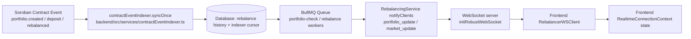

# Observability

This repository now includes a baseline observability stack for production debugging and alerting:

- Sentry for frontend and backend error tracking
- New Relic for optional backend APM
- Prometheus for metrics scraping
- Grafana for dashboards
- Loki + Promtail for centralized log aggregation
- Blackbox Exporter for uptime probes and WebSocket handshake validation
- Alertmanager for alert routing

## Blackbox uptime probes
Prometheus scrapes the Blackbox Exporter to validate externally visible availability across the main public surfaces.
The current deployment probes:

- `http://frontend:80/` — frontend application root
- `http://backend:3001/readiness` — backend deep readiness check
- `http://backend:3001/health` — backend process liveness
- `http://backend:3001/` via WebSocket handshake using `Upgrade: websocket`

The blackbox configuration is stored in `deployment/observability/blackbox/blackbox.yml`, and Prometheus scrape jobs are defined in `deployment/observability/prometheus/prometheus.yml`.

### Synthetic WebSocket probe

WebSocket availability is measured directly rather than inferred from HTTP metrics. The `websocket` module in `blackbox.yml` issues a real RFC 6455 opening handshake — `Connection: Upgrade`, `Upgrade: websocket`, `Sec-WebSocket-Version: 13` and a fixed `Sec-WebSocket-Key` — and only records success when the server:

1. answers with status `101 Switching Protocols`,
2. echoes an `Upgrade: websocket` response header, and
3. returns the `Sec-WebSocket-Accept` digest derived from the probe's key.

Checking the accept digest matters because a `101` alone only proves something in front of the backend agreed to switch protocols. The digest is `SHA1(key + RFC 6455 GUID)` base64-encoded, so a correct value proves the peer that answered is a real WebSocket server that read the probe's key — not a proxy or load balancer echoing a status line.

The probe target is the backend root URL. `backend/src/index.ts` attaches a `WebSocketServer` to the root HTTP server, so the root URL is the externally reachable WS entrypoint and needs no authentication to complete a handshake.

The `portfolio-websocket` scrape job runs the probe every 30s with a 15s timeout — its own interval rather than the 15s global default, to keep handshake churn on the socket low while still detecting an outage inside one alert evaluation window.

Failures feed the existing Prometheus/Alertmanager pipeline through two rules in `prometheus/alerts.yml`:

| Alert | Fires when | Severity | Notes |
| --- | --- | --- | --- |
| `WebSocketHandshakeFailed` | `probe_success == 0` for 5m | critical | paging route; suppressed while `BackendDown` is firing |
| `WebSocketProbeStalled` | no `probe_success` sample for 10m | warning | warning route |

`WebSocketProbeStalled` covers the blind spot where the exporter itself is down: without it, a missing probe looks identical to a healthy one.

## Backend

Backend observability is enabled with environment variables in [backend/.env.example](C:\Users\HP\Documents\students\drips\stellar-portfolio-rebalancer\backend\.env.example).

- `SENTRY_ENABLED=true` and `SENTRY_DSN=...` send unhandled backend exceptions to Sentry.
- `NEW_RELIC_ENABLED=true` and `NEW_RELIC_LICENSE_KEY=...` enable backend APM.
- `METRICS_ENABLED=true` exposes Prometheus metrics at `GET /metrics`.

The backend publishes:

- request count and latency metrics
- in-flight request gauge
- readiness status gauge
- BullMQ queue depth metrics
- structured JSON logs for Loki ingestion

## Frontend

Frontend Sentry is configured at build time through Vite env vars in [frontend/.env.example](C:\Users\HP\Documents\students\drips\stellar-portfolio-rebalancer\frontend\.env.example).

- `VITE_SENTRY_ENABLED=true`
- `VITE_SENTRY_DSN=...`

An application error boundary captures render failures and reports them to Sentry.

## Running The Stack

Start the app plus the monitoring stack:

```bash
docker compose -f deployment/docker-compose.yml --profile observability up --build
```

Main endpoints:

- App: `http://localhost:3000`
- Backend: `http://localhost:3001`
- Prometheus: `http://localhost:9090`
- Alertmanager: `http://localhost:9093`
- Grafana: `http://localhost:3003`
- Loki: `http://localhost:3100`

## Dashboards And Alerts

Grafana provisions:

- a Prometheus datasource
- a Loki datasource
- the `Portfolio Observability Overview` dashboard

Prometheus alerts are preconfigured for:

- backend metrics endpoint down
- backend readiness failures
- frontend uptime failures
- WebSocket handshake failures and a stalled WebSocket probe
- elevated backend 5xx rate
- failed rebalance queue jobs
- stale Reflector price rows observed in the last 15 minutes
- excessive fallback price usage over the last hour

The backend exports dedicated price-quality metrics:

- `stellar_portfolio_price_feed_resolutions_total`
- `stellar_portfolio_reflector_stale_prices_total`
- `stellar_portfolio_reflector_fallback_usage_total`

Alertmanager ships alerts to `http://host.docker.internal:5001/alerts` by default. Replace that receiver with your Slack, PagerDuty, Opsgenie, or webhook destination before production rollout.

## Real-time Event Flow

The backend currently has two connected real-time paths:

1. **On-chain ingestion path** (`contractEventIndexer`) that syncs Soroban contract events into backend persistence.
2. **WebSocket push path** (`RebalancingService` + `websocket.service.ts`) that broadcasts runtime portfolio/risk events to connected frontend clients.


```mermaid
flowchart LR
    A[Soroban Contract Event<br/>portfolio.created / deposit / rebalanced]
    B[contractEventIndexer.syncOnce<br/>backend/src/services/contractEventIndexer.ts]
    C[(Database: rebalance history + indexer cursor)]
    D[BullMQ Queue<br/>portfolio-check / rebalance workers]
    E[RebalancingService notifyClients<br/>portfolio_update / market_update]
    F[WebSocket server<br/>initRobustWebSocket]
    G[Frontend RebalancerWSClient]
    H[Frontend RealtimeConnectionContext state]

    A --> B
    B --> C
    C --> D
    D --> E
    E --> F
    F --> G
    G --> H
```

### WebSocket Message Schema

Protocol envelope validated in `backend/src/types/websocket.ts`:

- `version: string` (must equal `1.0.0`)
- `type: "PING" | "PONG" | "PRICE_UPDATE" | "REBALANCE_STATUS" | "ERROR"`
- `payload?: unknown`
- `timestamp: number` (milliseconds since epoch; defaults server-side when parsed)

Additional server-sent broadcast message shapes used by `RebalancingService`:

- `type: "portfolio_update"`
  - `portfolioId: string`
  - `event: string` (example: `rebalance_queued`, `rebalance_blocked`, `risk_alert`)
  - `data?: object`
  - `timestamp: string` (ISO datetime)
- `type: "market_update"`
  - `event: string`
  - `data?: object`
  - `timestamp: string` (ISO datetime)

Connection lifecycle messages used in `websocket.service.ts`:

- On connect: `{ "type": "connection", "message": "Validation and Monitoring Active", "version": "1.0.0" }`
- Protocol mismatch / invalid frame: `{ "type": "ERROR", "payload": "Incompatible version or format. Use v1.0.0" }`
- Ping response: `{ "type": "PONG", "version": "1.0.0" }`

## Structured Logging Schema

The backend uses `pino` to output structured JSON logs. This schema ensures logs are easily searchable and correlatable in Loki or any other log aggregator.

### Base Log Fields

Every log entry automatically includes the following standard fields:

- `level`: The severity of the log (e.g., `info`, `warn`, `error`).
- `time`: ISO 8601 formatted timestamp of when the event occurred.
- `service`: Identifies the source component (always `stellar-portfolio-backend`).
- `environment`: The deployment environment (`development`, `production`, etc.).
- `msg`: The human-readable log message.

### Correlation Keys

To trace a single logical operation across multiple log statements or services, we inject correlation IDs into the log payload.

- `requestId`: A unique identifier for the current HTTP request. It is automatically injected into all logs emitted within the request context via `AsyncLocalStorage`.

If you are logging within a worker or queue context, ensure you include a `jobId` or equivalent correlation key manually when starting the context.

### Audit Logs

Significant system actions (e.g., portfolio creations, configuration changes) are tracked using a dedicated `logAudit` helper. These logs contain:

- `event`: Always set to `"audit"`.
- `action`: A string describing the specific action taken (e.g., `portfolio_created`, `rebalance_triggered`).
- Additional fields specific to the action can be merged into the payload.

### Redaction

For security and compliance, sensitive fields in log payloads (like passwords, tokens, or PII) are automatically redacted before the log is printed.
