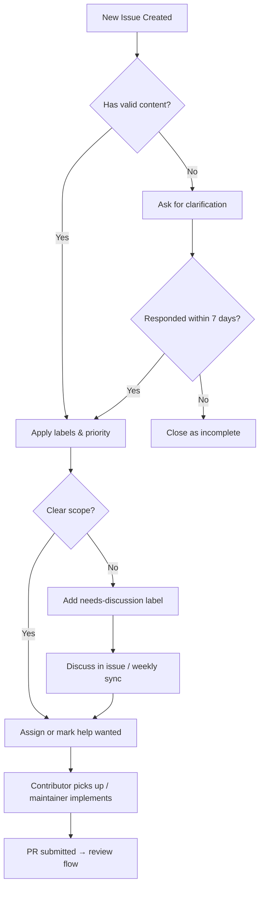
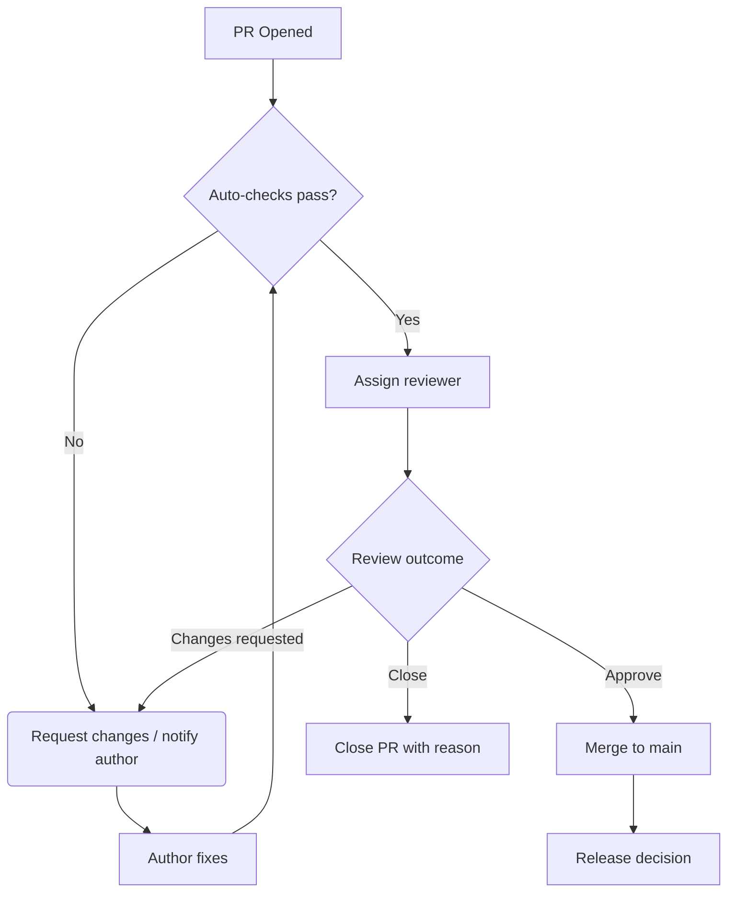

# Maintainer Triage Guide

This guide describes how maintainers label, prioritize, respond to, and close issues and pull requests in this repository. It keeps workflows consistent and contributors informed.

---

## 1. Issue Triage Flow

### Labels

| Label | Color | Meaning |
|-------|-------|---------|
| `bug` | Red | Reproducible defect |
| `enhancement` | Green | New feature or improvement |
| `docs` | Blue | Documentation change only |
| `devops` | Orange | CI/CD, Docker, deployment, tooling |
| `good first issue` | Purple | Good for new contributors |
| `help wanted` | Grey | Extra attention needed |
| `needs-discussion` | Yellow | Requires more input before planning |
| `security` | Red | Security-related issue (high priority) |

### Priority Levels

| Priority | Label | Response SLA | Resolution Target |
|----------|-------|-------------|-------------------|
| 🔴 Critical | `critical` | < 4 hours | < 24 hours |
| 🟠 High | bug label | < 24 hours | < 3 days |
| 🟡 Medium | enhancement | < 3 days | < 2 weeks |
| 🟢 Low | good first issue / docs | < 1 week | Next milestone |

---

## 2. Pull Request Flow

### PR Response Targets

| PR Size | Review SLA |
|---------|-----------|
| 🟢 Small (1-3 files, doc-only) | < 24 hours |
| 🟡 Medium (4-10 files) | < 3 days |
| 🔴 Large (11+ files) | < 5 days |

### PR Checklist for Reviewers

- [ ] PR links to a related issue (or rationale stated if no issue)
- [ ] All CI checks pass (lint, test, build)
- [ ] New code has tests where applicable
- [ ] Documentation updated if behavior changed
- [ ] No breaking API changes without changelog note

---

## 3. Closing Rules

**Close with `wontfix` when:**
- The request is out of scope for current product direction
- An existing workaround is sufficient
- The cost-to-value ratio does not justify the change

**Close with `duplicate` when:**
- An identical or overlapping issue exists (link it)
- The discussion in the duplicate covers the same topic

**Close with `incomplete` when:**
- The reporter did not provide requested details after 7 days
- The issue cannot be reproduced without additional info

---

## 4. Communication Patterns

| Situation | Comment Template |
|-----------|-----------------|
| First response to bug | "Thanks for the report @user. Can you share your environment details and steps to reproduce?" |
| Assigning an issue | "Assigning this to @contributor — estimated delivery: [date]" |
| Closing as duplicate | "Thanks @user. Closing as duplicate of #[original_issue] — please continue the discussion there." |
| Closing PR without merge | "Thank you for your PR @contributor. We've decided not to merge this because [reason]. Appreciate the effort!" |
| Stale issue | "This issue has been inactive for 30 days. Please comment if it's still relevant, otherwise it will be closed in 7 days." |

---

## 5. Maintenance Cadence

| Activity | Frequency | Owner |
|----------|-----------|-------|
| Triage new issues | Weekly (Mondays) | Any maintainer |
| Review open PRs | Every 48 hours | Assigned reviewer |
| Update roadmap | Monthly | Lead maintainer |
| Close stale issues | Monthly | Any maintainer |
| Review security issues | As needed (immediate) | Security POC |

---

## 6. Security Issues

- Security issues are **private** (use GitHub Security Advisory)
- Do not discuss security details in public issues or PRs
- Tag with `security` label immediately
- Assign highest priority
- Reach the maintainer via [email/contact in SECURITY.md]

---

## 7. Getting Help

- **For contributors:** Post in the issue thread or join the [project discussion](https://github.com/ritik4ever/stellar-portfolio-rebalancer/discussions)
- **For maintainers:** Refer to [OPERATIONS.md](./docs/OPERATIONS.md) for infrastructure and deployment procedures
